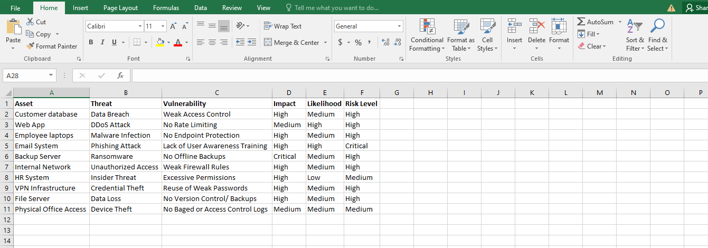
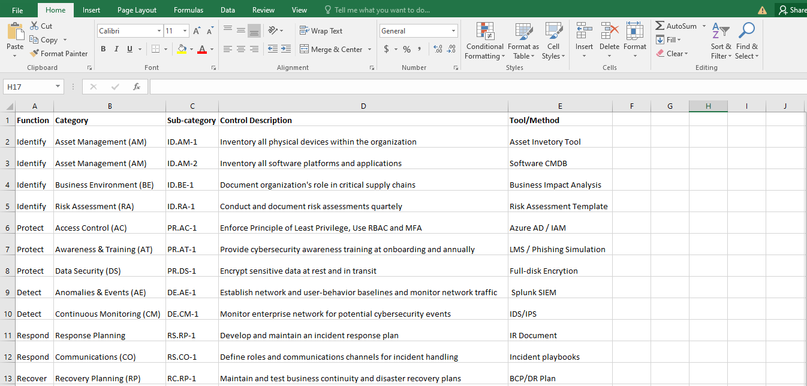

# 📖 NIST CSF Implementation Plan For X Bank (Fictional Company)

This repository contains a comprehensive implementation of the NIST Cybersecurity Framework (CSF) for a fictional organization, X Bank. It demonstrates how organizations can assess and improve their cybersecurity posture using structured risk analysis, mapped controls, and policy development.

---

## 📚 Overview

The implementation covers the five NIST CSF core functions:

- **Identify**  
- **Protect**  
- **Detect**  
- **Respond**  
- **Recover**

---

## 🔧 Tools, Techniques and Framework Used

- NIST CSF Core Funtions & Subcategories
- Risk Register Development (Excel)
- NIST CSF Subcategory Control Mapping (Excel)
- Security Policy Writing & Documentation (PDF)
- Implementation Timeline & Appendix References
- Security Best Practices & Compliance Principles

---
## 🧠 Learning Objectives

This project demonstrates how to:

- Apply the NIST CSF practically in a fictional company setting
- Evaluate risks and document them in a structured risk register
- Map existing/planned controls to CSF subcategories
- Draft enforceable cybersecurity policies
- Document, organize, and present cybersecurity strategy professionally

---

## 📖 Steps Taken

1. Define Project Scope
2. Mapped NIST CSF Core Functions
3. Create a Risk Register
4. Mapped Controls to CSF Subcategories
5. Drafted Policy Documents
6. Built an Implementtion Timeline
7. Structured Documentation and Appendices

---

### Step 1: 🔍 Defined Project Scope

  - Selected a fictional company: X Bank

  - Identified the goal: Implement and document a cybersecurity strategy using the NIST CSF.

---

### Step 2: 🧭 Mapped NIST CSF Core Functions

Studied the NIST CSF Core Functions, broke them down into Categories and Subcategories:

1. Identify 
   - Asset management approach 
   - Risk assessment methods 
   - Governance practices 

2. Protect 
   - Access control measures 
   - Acceptable use policies 
   - Data protection techniques 
   - Staff awareness programs 

3. Detect 
   - Monitoring tools used 
   - Event detection mechanisms 
   - Alert and escalation strategy 

4. Respond 
   - Incident response planning 
   - Communication plans 
   - Forensic analysis methods 

5. Recover 
   - Backup and restore process 
   - Lessons learned documentation 
   - Disaster recovery and business continuity strategies

---

### Step 3: 📊 Created a Risk Register

- Documented critical assets (e.g., customer database, web application)

- Identified threats, vulnerabilities, and their impacts

- Evaluated Likelihood and Impact to determine Risk Levels

- Created in Excel: Risk-Register.xlsx as illustrated below:

*Screenshot of the risk register created in Excel.*

---

### Step 4: 🗂 Mapped Controls to CSF Subcategories

Mapped appropriate technical and administrative controls to each CSF subcategory relevant to the organization

Organized in Excel: NIST-CSF-Control-Mapping.xlsx as illustrated below:

*Screenshot of NIST CSF Control Mapping in Excel.*

---

### Step 5: 📝 Drafted Policy Documents

Each policy aligns with one or more NIST CSF subcategories.

Each policy includes purpose, scope, policy, responsible parties, and enforcement clauses in alignment with NIST CSF subcategories.

Policies include: 

   - Asset Management Policy *(Identify - ID.AM-1, ID.AM-2)*
   - Access Control Policy *(Protect - PR.AC-1)*
   - Acceptable Use Policy (AUP) *(Protect - PR.AT-1)*
   - Security Awareness & Training *(Protect - PR.AT-1)*
   - Incident Response Policy *(RS.RP-1, RS.CO-1)*
   - Backup & Recovery Policy *(Recover - RC.RP-1)*
   - Business Continuity Policy *(Recover - RC.RP-1)*

Full policy versions are available in the Appendix.

---

### Step 6: 🗓️ Implementation Timeline

Built an implementation timeline with phased rollout of:

  - Policy enforcement

  - Employee awareness training

  - Security reviews

  - Incident response procedures

Below is the implementation timeline:

| Phase  |Timeline  | Task                                       | Responsibility Party            | Notes             |
|---------------|----------|------------------------------------------|-----------------------------|--------------------------|
| Phase 1 - Planning         | Month 1 | Conduct NIST CSF gap analysis          | CISO/ Security Lead  | Use Self assessment or external audit |
| Phase 2 - Governance Setup | Month 2 | Define cybersecurity roles  policies     | HR + IT + Compliance | Includes Acceptable Use, BCP, etc. |
| Phase 3 - Inventory & Risk | Month 3 | Complete asset inventory & risk register | IT Department        | Match to ID.AM category |
| Phase 4 - Control Implementation | Month 4 - 6 | Implement basic controls (access, backups, MFA, etc.) | IT + Security Operations | Covers Protect function |
| Phase 5 - Awareness & Training | Month 5 | Launch security awareness training | HR + IT | Include phishing simulation | 
| Phase 6 - IR Planning | Month 6 | Develop & test incident response plan | Security Operations | Align with Response function | 
| Phase 7 - Monitoring & SIEM | Month 7 | Deploy SIEM, log monitoring tools | SOC Team | Begin continuous monitoring |
| Phase 8 - Business Continuity | Month 8 | Finalize and test BC & DR plans | IT Operations | Backup validations, failover testing | 
| Phase 9 - Review & Audit | Month 9 | Conduct internal audit & gap reassessnent | Internal Audit | Compare against initial results |
| Phase 10 - Optimization | Month 10+ | Refine policies, update controls | Security Steering Committee | Ongoing improvement |

#### 📜 Review and Maintenance

The implementation plan will be reviewed annually. 

Metrics and ownership of tasks are documented to ensure continuous improvement and successful measurement.

---

### Step 7: 📋 Structured Documentation and Appendices

Organized all files and policies into a clear GitHub project

Linked all documents in the README.md for easy navigation

Added an appendix table to reference each file

#### Appendix A: Supporting Documents

| Appendix | Description                                          | File |
|----------|------------------------------------------------------|------|
| A        | Detailed NIST CSF Implementation Plan for X Bank     | [Click To View NIST CSF Implemetation Plan](https://github.com/ninahonyango/NIST/blob/main/NIST-XBANK/NISTCybersecurityFramework.pdf) |
| B        | Security Policy Documents (AUP, ACP, IRP, DRP etc.)  | [Click To View Security Policy Document](https://github.com/ninahonyango/NIST/blob/main/NIST-XBANK/policies.pdf) |
| C        | Risk Register (Threats, Vulnerabilities, Risks)      | [Download To View Risk Register Spreadsheet](https://github.com/ninahonyango/NIST/blob/main/NIST-XBANK/RiskRegister.xlsx) |
| D        | NIST CSF Control Mapping                             | [Download To View NIST CSF Control Mapping Sheet](https://github.com/ninahonyango/NIST/blob/main/NIST-XBANK/NISTControlMappingSheet.xlsx) |

---

## 📌 Disclaimer

This project is for educational purposes and represents a simulated cybersecurity implementation for a fictional company.

---

